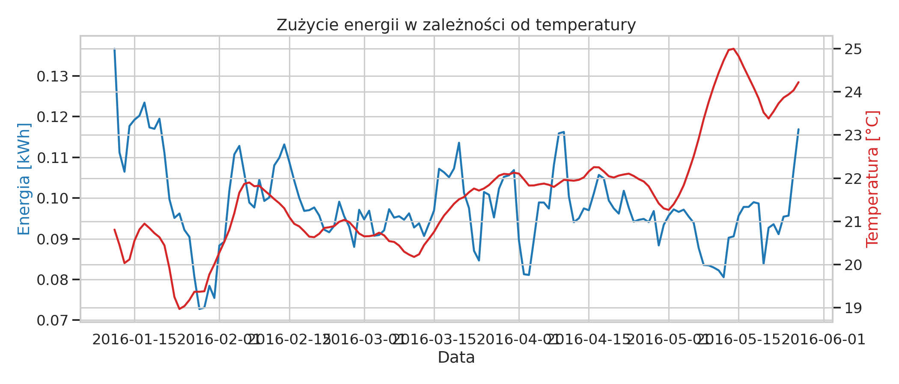
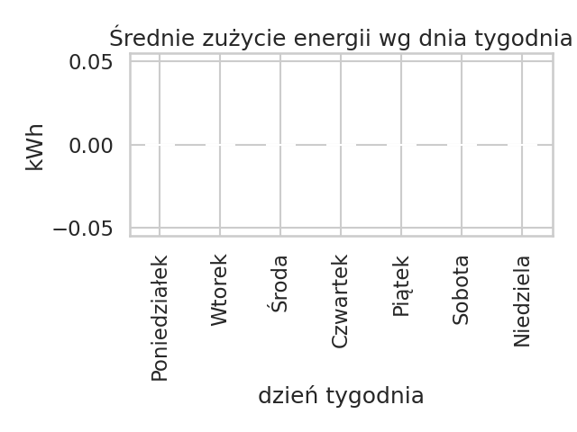
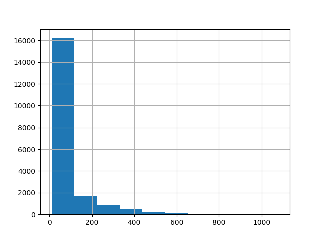

# Sprawozdanie – analiza danych IoT

## 1. Cel
Celem ćwiczenia była analiza danych pochodzących z domowego systemu IoT oraz ich wizualizacja. W ramach zadania wykorzystano bibliotekę Pandas do wczytania i przetwarzania danych z pliku CSV, a następnie przedstawiono je w formie wykresów.

## 2. Dane
Dane zostały wczytane z pliku CSV przy użyciu biblioteki Pandas.

## 3. Wykresy

### Zużycie energii
Wykres przedstawia zmiany zużycia energii w czasie.

### Temperatura
Wykres przedstawia zmiany temperatury w czasie.

### Histogram
Wykres przedstawia rozkład wartości zużycia energii.

## 4. Wnioski
Zużycie energii wykazuje duże wahania w czasie.Można zauważyć okresy większego i mniejszego zużycia. Temperatura może mieć wpływ na zużycie energii. Dane wykazują korelacje między niektórymi zmiennymi.