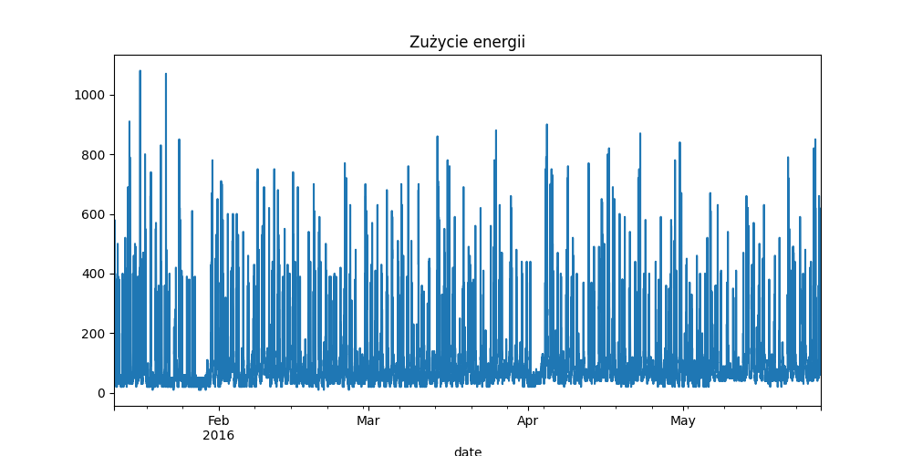
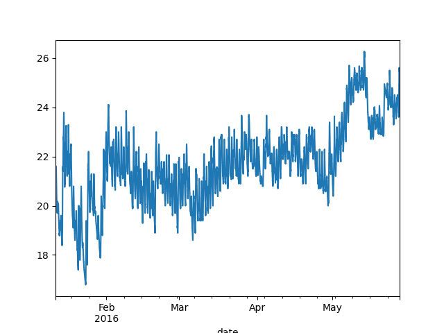
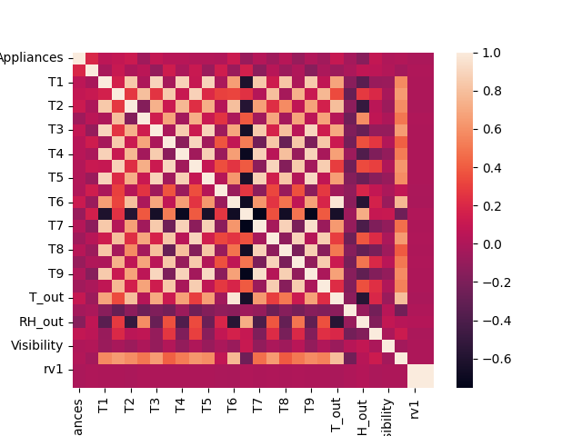

# Sprawozdanie – analiza danych IoT

## 1. Cel
Celem projektu była analiza danych z systemu IoT oraz wizualizacja wyników pomiarów.

## 2. Dane
Dane zostały wczytane z pliku CSV przy użyciu biblioteki Pandas.

## 3. Wykresy

### Zużycie energii

### Temperatura

### Histogram

### Korelacje

## 4. Wnioski
- zużycie energii zmienia się w czasie
- temperatura może mieć wpływ na zużycie energii
- widoczne są zależności między zmiennymi